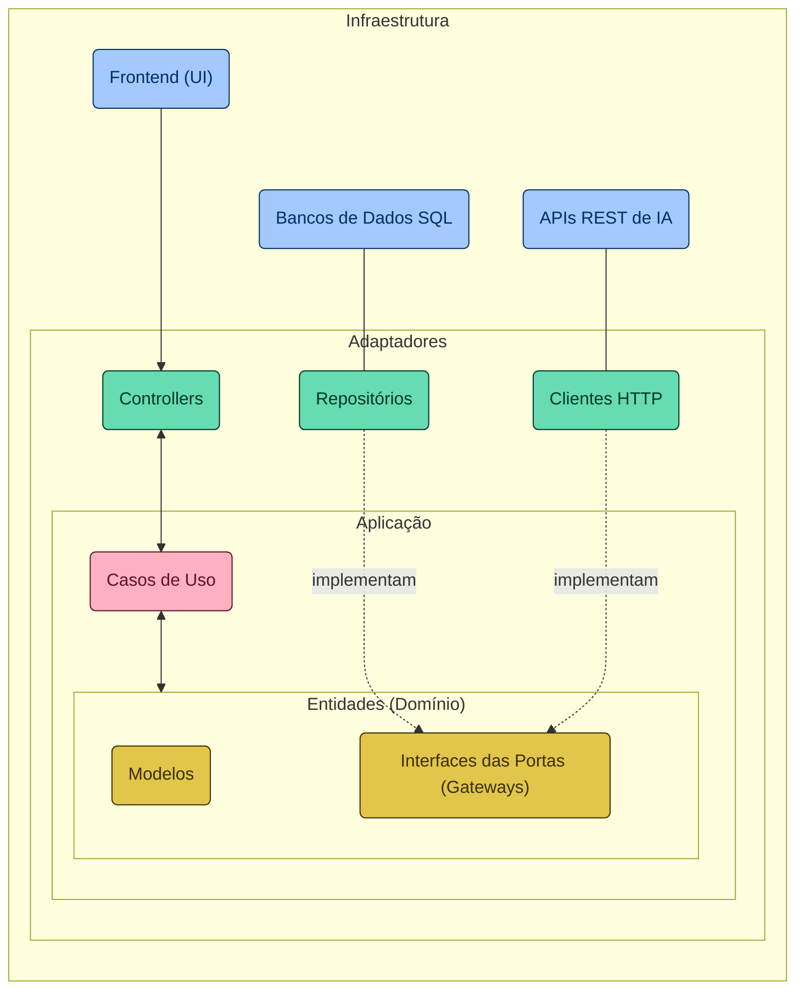

# Santander Dev Week 2024

RESTful API da Santander Dev Week 2024 construída em Java 21 com Spring Boot 3. Uma iniciativa fruto da parceria entre DIO e Santander para a divulgação dos Bootcamps Santander 2024.

## Subindo API para AWS
- Necessário ter conta na AWS (obviamente)
- Gerar arquivo .jar referente ao projeto da aplicação da API em si
- Utilizar o Elastic Beanstalk para subida de aplicações padronizadas (que utilizam Spring, por exemplo)
- Seguir passo a passo para configurar aplicação na AWS
- Necessário usuário ter algumas ROLES específicas, referentes ao profile de EC2 (AWSElasticBeanstalkWebTier, AWSElasticBeanstalkWorkerTier, AWSElasticBeanstalkMulticontainerDocker)

## Comunicação com Generative AI
- OpenAI API: https://platform.openai.com/docs/api-reference/chat/create
- Google Gemini: https://ai.google.dev/tutorials/rest_quickstart
- Como foi utilizada Clean Architecture, foi criado o serviço de Generative API em ports, dentro de domain, a ser utilizado pelo UseCase responsável ao gerenciamento de perguntas aos campeões do LOL
  - Tal serviço é implementado por Adapters que realizam, de fato, a comunicação com as APIs externas (OpenAI e Gemini)
  - Nesse caso, deve ser especificado qual Adapter, referente a qual API de IA será utlizada na aplicação (questão resolvida facilmente utilizando Spring, condicionando qual interface será usada na aplicação em determinado momento) 

## Diagrama Arquitetural Simplificado

## Estrutura de Diretórios

Sendo assim, a aplicação está organizada seguindo os princípios da [Clean Architecture](https://blog.cleancoder.com/uncle-bob/2012/08/13/the-clean-architecture.html), com o objetivo de separar as responsabilidades de maneira clara e promover a independência das camadas. Abaixo está a estrutura de diretórios adotada:

- `adapters/` - Contém os adaptadores que interagem com mecanismos externos ou recebem requisições do usuário.
  - `in/` - Adaptadores de entrada, como controladores REST, responsáveis por receber as requisições dos usuários.
  - `out/` - Adaptadores de saída, para interação com bancos de dados e APIs externas.
- `application/` - Define os casos de uso da aplicação, encapsulando a lógica de negócios.
- `domain/` - O núcleo da aplicação, incluindo entidades, exceções e interfaces (portas) que definem as regras de negócio.
  - `exception/` - Exceções personalizadas do domínio.
  - `model/` - Modelos de entidades do domínio.
  - `ports/` - Interfaces que definem os contratos para os adaptadores e serviços externos.
- `Application.java` - Classe principal que inicia a aplicação.

Esta estrutura promove a divisão das responsabilidades, facilitando a manutenção, testabilidade e a escalabilidade do sistema.
